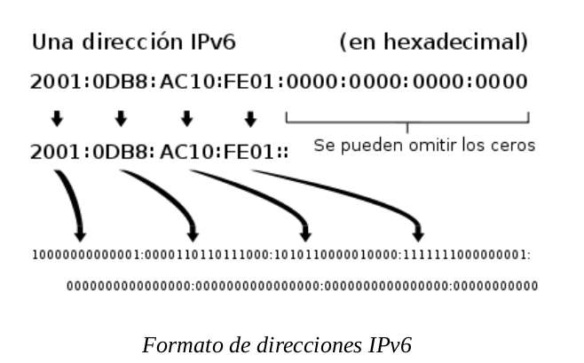

- [Control de servicios y demonios](#control-de-servicios-y-demonios)
  - [Servicios y demonios.](#servicios-y-demonios)
    - [Máscaras](#máscaras)
  - [El proceso de arranque](#el-proceso-de-arranque)
    - [Targets](#targets)
    - [Recuperación de la passwd de root](#recuperación-de-la-passwd-de-root)
    - [Consola de depuración](#consola-de-depuración)
    - [Stuck jobs](#stuck-jobs)
- [IPv6](#ipv6)
  - [Direcciones IPv6](#direcciones-ipv6)
    - [Subredes](#subredes)
  - [IPs comunes](#ips-comunes)
    - [Cálculo de direcciones locales (_link local_)](#cálculo-de-direcciones-locales-_link-local_)
  - [Configuración de direcciones IPv6](#configuración-de-direcciones-ipv6)
  - [Configuración](#configuración)
- [Agregación de enlaces (teaming) y bridging](#agregación-de-enlaces-teaming-y-bridging)
  - [Teaming](#teaming)
    - [Reglas: ¿Cómo maneja esto NetworkManager?](#reglas-cómo-maneja-esto-networkmanager)
    - [Trabajo con _team interface_](#trabajo-con-_team-interface_)
      - [Crear el interfaz](#crear-el-interfaz)
      - [Atributos IPv4/IPv6](#atributos-ipv4ipv6)
      - [Asginar puertos](#asginar-puertos)
      - [Cierre y arranque del Teaming](#cierre-y-arranque-del-teaming)
    - [Administración del Teaming](#administración-del-teaming)
    - [Troubleshooting](#troubleshooting)
  - [Software bridge](#software-bridge)
    - [Procedimiemto para configurar un bridge por software](#procedimiemto-para-configurar-un-bridge-por-software)
    - [Control de bridge](#control-de-bridge)
  - [Teaming + Bridging](#teaming--bridging)

# Control de servicios y demonios

## Servicios y demonios.

* **systemd** administra el arranque del sistema y los procesos y servicios del servidor (tiene el ID=1). En versiones anteriores, lo gestionaba **init** (tenía por debajo _xinetd_ y _initd_).
  - Puede paralelizar y aumentar velocidad del arranque.
  - Inicio bajo demanda de los servicios.
  - Administración automática de las dependencias de los servicios.
  - Podemos saber las dependencias del servicio -por arriba y por abajo.
  - Podemos hacer seguimiento de los servicios a través de los _linux control groups_, que se usan para agrupar servicios destinados al mismo fin.
* **daemon** proceso que ejecutan tareas que esperan y se ejecutan en segundo plano (convención, terminan su nombre por "d").
* Para comunicarse con los procesos usan **sockets**.

La _units_ son difentes tipos de "servicios", hay de diferentes tipos.

* Lista de tipos de unidades disponibles: `systemctl -t help`
  - _service_: servicios
  - _socket_: comunicaciones interprocesos, podemos usarlos para levantar servicios
  - _busname_
  - _target_
  - _snapshot_
  - _device_
  - _mount_
  - _automount_
  - _swap_
  - _timer_
  - _path:_ rutas del sistema que marcan un disparador (si dejamos algo, hará que algo se levante).
  - _slice_
  - _scope_
* Ver el fichero de configuración de una unit: `systemctl cat nombre`
* Ver todas las propiedades del la unit: `systemctl show nombre`
* Ver toda la información de una unit: `systemctl show nombre`
* Arrancar, parar, ...: `systemctl {start|stop|restart|reload} nombre`
* Ver estado: `systemctl status nombre` ("-l" más información)
  - Puede tener estos estados:
    - **loaded**: Se ha procesado el fichero de configuración
    - **active (running)**: Corriendo con uno o más procesos
    - **active (exited)**: Completada la configración OK
    - **active (waiting)**: Corriendo pero esperando un evento.
    - **inactive**: Parado
    - **enabled**: Arrancará en tiempo de boot
    - **disabled**: No arrancará en tiempo de boot
    - **static**: No puede ser habilitado, pero puede ser arrancado por otra unit de forma automática, no lo podemos tocar nosotros.
* Ver si está habilitado: `systemctl is-enabled servicio`
* Ver si está activo: `systemctl is-active servicio`
* Ver dependencias de nuestro servicio:
  - De quien depende nuestra unidad: `systemctl list-dependencies unidad`
  - Quien necesita mi unidad: `systemctl list-dependencies unidad --reverse`
* Listado de _unit files_
  - Verificar en el arranque: `systemctl`
  - Verificar el estado de los servicios: `systemctl --type=service`
  - Ver las units: `systemctl lsit-units [--all] --type=service` (muestra los activos, con "--all", todos).
  - Estado de las unidades en el arranque: `systemctl lsit-unit-files` (admite "--type")
  - Estado de las unidades que han fallado: `systemctl --failed --type=service`

### Máscaras

RH dice que no son compatibles **NetworkManager** y **network** y de hecho indican que el que manda el _NetworkManager_ y se apoya para ciertas cosas en _network_ y en caso de caída del primero, el segundo tomaría el control.

`systemctl {mask|umask} servicio`, lo que hace es un link a `/dev/null` de las unidades. (/etc/systemd/system/nombre.service` ó `/usr/lib/systemd/target`)

El enmascaramiento nos permite queSubredes nadie arranque de forma manual o automática el servicio.

## El proceso de arranque

### Targets

Estos son los targets del sistema:
* **graphical.target**: Sistema con múltiples usuarios, logins basados en texto y gráficos.
* **multi-user.target**: Sistema con múltiples usuarios y login basado en texto.
* **rescue.target**: _suloging_ prSubredesompt, inicialización básica del sistema
* **emergency.target**: _sulogin_ prompt y pivote _initramfs_ completo con / montado en modo sólo lectura.

Dependencias entre targets: `systemctl list-dependencies nombre.target|grep target`

Targets del sistema: `systemctl list-units --type=target --all`
  ```bash
  UNIT                   LOAD   ACTIVE   SUB    DESCRIPTION
  basic.target           loaded active   active Basic System
  cryptsetup.target      loaded active   active Encrypted Volumes
  emergency.target       loaded inactive dead   Emergency Mode
  final.target           loaded inactive dead   Final Step
  getty.target           loaded active   active Login Prompts
  graphical.target       loaded active   active Graphical Interface
  local-fs-pre.target    loaded active   active Local File Systems (Pre)
  local-fs.target        loaded active   active Local File Systems
  multi-user.target      loaded acSubredestive   active Multi-User System
  network-online.target  loaded inactive dead   Network is Online
  network.target         loaded active   active Network
  nfs.target             loaded active   active Network File System Server
  nss-lookup.target      loaded inactive dead   Host and Network Name Lookups
  nss-user-lookup.target loaded inactive dead   User and Group Name Lookups
  paths.target           loaded active   active Paths
  remote-fs-pre.target   loaded inactive dead   Remote File Systems (Pre)
  remote-fs.target       loaded active   active Remote File Systems
  rescue.target          loaded inactive dead   Rescue Mode
  shutdown.target        loaded inactive dead   Shutdown
  slices.target          loaded active   active Slices
  sockets.target         loaded active   active Sockets
  swap.target            loaded active   active Swap
  sysinit.target         loaded active   active System Initialization
  syslog.target          not-found inactive dead   syslog.target
  time-sync.target       loaded inactive dead   System Time Synchronized
  timers.target          loaded active   active Timers
  umount.target          loaded inactive dead   Unmount All Filesystems

  LOAD   = Reflects whether the unit definition was properly loaded.Subredes
  ACTIVE = The high-level unit activation state, i.e. generalization of SUB.
  SUB    = The low-level unit activation state, values depend on unit type.

  27 loaded units listed.
  To show all installed unit files use 'systemctl list-unit-files'.
  ```
* Cambiar a un target: `systemctl isolate nombre.target`
  - sólo los que tengan _AllowIsolate=yes_ pueden ser objeto de este cambio
* Obtener el target por defecto: `systemctl get-default`
* Cambiar el target por defecto: `systemctl set-default nombre`Subredes
  ```bash
  $ ls -l /usr/lib/systemd/system/default.target
  lrwxrwxrwx. 1 root root 16 Mar  8 16:24 /usr/lib/systemd/system/default.target -> graphical.target
  ```
* Podemos cambiar el target en el arranque cambiando la línea de kernel, poniendo: `systemd.unit=new_target.target` (normalmente ponemos _emergency.target_), después **Ctrl+X**
  - Recordar que una vez arreglado lo que se arregle, `systemctl daemon-reload` para que coja los nuevos fichreros de configuración que hayamos arreglado.

### Recuperación de la passwd de root
Subredes
Ya visto en el curso de SA:
1. Reiniciar el sistema
2. Interrumpir el _boot loader_ presionando una tecla
3. Pulsar "e" para entrar en la edición del arranque.
4. Editar la línea del kernel (_linux16_) y poner `console=tty0 rd.break`
5. Ctrl+x para arrancar con los cambios (aquí tenemos montado /sysroot con ro).
6. Montar en modo lectura/escritura: `mount -o remount,rw /sysroot`
7. Montamos la jaula chroot: `chroot /sysroot`
8. Cambiamos la password de root: `passwd root`
9. Indicamos que se restauren los contextos selinux en el siguiente arranque: `touch /.autorelabel`
10. Salimos dos veces (`exit; exit;`), la primera nos saca de la jaula y la segunda del _initramfs_

### Consola de depuración

`systemctl enable debug-shell.service`, nos hablitará la consola de depuración que no necesita meter la contraseña de root (nos metemos en ella con **Ctrl+Alt+F9**).
`systemctl start debug-shell.service`

### Stuck jobs

`systemctl list-jobs`, los servicios que estén en espera no arrancarán hasta que no arranquen los servicios de los que dependen. Así que si en el arranque tenemos algún problema tendremos que ver de que dependen los que están en waiting y ver por qué los otros no ceden el control.

# IPv6

Protocolo que sustituye a IPv4, llevSubredesa muchas más cosas por defecto.
* Direcciones más largas. (128 bits en vez de 32)
* IPSec activado por defecto.
* Muy autoconfigurable, basta con tener un router en la red que soporte IPv6.

El mayor problema que tiene es que el protocolo no tiene una forma simple para que sistemas que sólo tinen IPv6 se comuniquen con IPv4. Para solucionarSubredes esto se implementa _DualStrack_, que es configurar una red con IPv4 e IPv6 de forma que recursos de internet que usen uno de los protocolos puedean ser alcanzados desde el host.

## Direcciones IPv6

128 bits distribuidos en 8 grupos de 4 cuartetos hexadecimales, separados por "**:**". Cada cuarteto representa 4 bits de la dirección IPSubredesv6, con lo que cada grupo representa 16 bits.

Reglas de formación:
* Los ceros a la izquierda no se representan.
* Si en un grupo hay varios ceros, se agrupan (apócope): `2001:db8:0:10::1`
* No se pueden apocopar dos grupos de ceros: es incorrecto: `2001:b1::3b4::3a` por que no tenemos forma de saber cuántos grupos van en cada apócope.
* Para agrupar ceros, se apocopa el mayor conjunto o, en caso de igualdad, el de más a la izquierda: `2001::1f3a:0:0:3ab`Subredes
* Para representar IP:puerto, se pone la ip entre corchetes: `[2001:1bc::13f:0:a]:8080`

Las direcciones se clasifican en tres tipos:
* **Unicast**: Identificador para una única interfaz. Un paquete enviado a una dirección unicast es entregado sólo a la interfaz identificada con dicha dirección. Es el equivalente a las direcciones IPv4 actuales.
* **Anycast**:  Identificador para un conjunto de interfaces (típicamente pertenecen a diferentes nodos). Un  paquete enviado a una dirección anycast es entregado en una (cualquiera) de las interfaces identificadas con dicha dirección (la más próxima, de acuerdo a las medidas de distancia del protocolo de encaminado).  
	Nos permite crear, por ejemplo, ámbitos de redundancia, de forma que varias máquinas puedan ocuparse del mismo tráfico según una secuencia determinada (por el routing), si la primera “cae”.
* **Multicast**: Identificador para un conjunto de interfaces (por lo general pertenecientes a diferentes nodos). Un paquete enviado a una dirección multicast es entregado a todas las interfaces identificadas por dicha dirección.  
	La misión de este tipo de paquetes es evidente: aplicaciones de retransmisión múltiple (broadcast). 



### Subredes

Una dirección unicast normal e divide en dos partes, _prefijo de red_ e _interfaz ID_, el primero identifica la subred y el segundo la interfáz de red. Ningún par de interfaces de red pueden tener el mismo _interfaz ID_ en la misma subred.

* IPv6 tiene una máscara de subred estándar **/64**, la mitad de la dirección es subred y la otra mitad interfáz.
* Típicamente, el proveedor de red asigna un prefijo más corto a una organización, **/48**, lo que deja lo que deja el resto de la red para asignar subredes (16 bits --> 65536 subredes).

## IPs comunes

* **::1/128**: localhost
* **::**: Dirección sin especificar, indica que está escuchando por todas las IPs configuradas
* **::/0**: ruta por defecto
* **2000::/3**: Scope global (IPs públicas) - direcciones globales de unicast
* **fd00::/8**: Direcciones locales únicas (IPs privadas)
* **fe80::/10**: Scope link (link local)
* **ff00::/8**: multicast
* **ff02::1**: Dirección de multidifusión

### Cálculo de direcciones locales (_link local_)

Las direcciones de link local son direcciones no enrrutables que se usan sólo para hablar con los host en un enlace de red específico. Cada interfáz de red se configura automáticamente con un link-local en la red _fe80::/64_. Para asegurase de que es única, la _interfaz ID_ de la dirección se construye a partir de la MAC de esa interfáz.

1. Partimos de la MAC: `52:74:f2:b1:a8:7f`
2. Añadimos en el centro _ff:fe_: `52:74:f2:ff:fe:b1:a8:7f`
3. Pasmos el primer grupo a binario: `52 --> 01010010`
4. Invertimos bit 6: `01010000 --> 50`
5. Lo trasladamos a lo que teníamos: `5074:f2ff:feb1:a87f`
6. Añadimos la máscara del tipo de red: `fe80::5074:f2ff:feb1:a87f`

## Configuración de direcciones IPv6

Hay tres formas de configurar las direcciones:
* **Estáticas**: como en IPv4
	- No podemos usar las siguientes direcciones:
		- El interfaz ID todo ceros: _0:0:0:0_ llamado _subner router unicast_, que usan todos los routers del enlace.
		- Los identificadores entre: _fdff:ffff:ffff:ff80_ y _fdff:ffff:ffff:ffff_
* **Dinámicas**: dos formas distintas:
	- DHCPv6: Funciona un poco diferente que DHCPv4 ya que no hay broadcast:
		- Un host manda una petición DHCPv6 al puerto 547/UDP por **ff02::1:2** (grupo de multicast _all-dhcp-servers_)
		- El servidor DHCPv6 manda una respuesta con la información necesaria a través del puerto 546/UDP sobre la dirección local del cliente.
  - SLAAC (_Stateless Address Autoconfiguration_): Es el método por defecto en RHEL7, paquete **radvd**
		- El host levanta su interfáz con el link local: **fe80::/64**
		- Manda una solicitud de router a **ff02::2** (grupo de multicast _all-routers_).
		- Un router en el link local responde al link-local del host con un prefijo de red y otra información.
		- El host usa el prefijo con un _interfaz ID_ para construir la dirección de misma forma que lo hacer para la dirección del link-local.
		- El router manda periódicamente actualizaciones multicast (_router advertisements_) para confirmar o actualizar la información que provee.

## Configuración

Como en IPv4, también se usa **nmcli** cambiando v4 por v6


# Agregación de enlaces (teaming) y bridging

man 5 nmcli-examples
- 7 y 8 nos dan ejemplos de lo que tenemos que hacer bridge y teaming.

Más documentación:
* /user/share/doc/teamd-*
* /user/share/doc/bridge-utils/HOW-TO

## Teaming

Nos permite dos o mas tarjetas de red (NICs) como si fueran una sola de forma que nos dará ciertas ventajas.
* alta disponibilidad
* mejora del rendimiento

Conceptos:
* **teamd** Nos permite manipular la lógica
* **kernel** Manipula los paquetes
* **runners** Los modos en que puede estar trabajando el teaming
  - _broadcast_: A todos los nodos del teaming.
  - _round robin_: Distribución entre los puertos de teaming el trabajo.
  - _active backup_: Un puerto trabaja y el otro está de refuerzo.
  - _load balance_: distribuye la carga entre los interfaces que forman los puertos del teaming.
  - _LACP_: Preparado para ejecutar el protocolo de agregación 802.3ad - Pone los dos puertos trabajando a la vez, con lo que doblamos el ancho de banda
* **port**: cada una de las NIC que forman el team

### Reglas: ¿Cómo maneja esto NetworkManager?

* Inicio del teaming no produce el reinicio automático de los puerts asignados.
* Inicio de un port produce un inicio automático del teaming
* Parada del teaming  detiene las interfaces port
* Teaming sin ports (NIC) puede tener definida una ip estática.
* Teaming sin ports (NIC) configurado por DHCP espera a los puertos que lo componen (si no tenemos ningún puerto no tenemos red y no podrá recibir nada de DHCP).
* Teaming configurado por DHCP espera a los puertos hasta que uno de ellos tiene portadora.
* Teaming configurado por DHCP espera portadora (_waiting_).

### Trabajo con _team interface_

Lo vamos a hacer con _NetworkManager_ y con _network_.
1. Crear el teaming (interfaz).
2. IPv4/IPv6 teaming (configuración estática del interfaz).
3. Asignamos los ports.
4. Cierre y arranque del teaming (arranque de uno de los puertos al menos).

#### Crear el interfaz

```
nmcli con add type team con-name CNAME ifname INAME [config JSON]
```
Donde:
* CNAME: nombre del Teaming
* INAME: nombre de la interfaz del Teaming
* JSON: configuración en formato json que define el _runner_ de la forma: `'{"runner": {"name": "METHOD"}}'`
  - Donde _METHOD_ puede ser: _broadcast_, _roundrobin_, _activebackup_, _loadbalance_ o _lacp_
  - aunque este parámetro es optitivo, se pone siempre

#### Atributos IPv4/IPv6

Venimos de DHCP y asignamos ip estática:

```
nmcli con mod CNAME ipv4.addresses IP/PREFIX GW
nmcli con mod CNAME ipv4.method manual
```

#### Asginar puertos

Mirar las lienas qeu viene en `man nmcli-examples` (ojo, dependiendo de las verisones, puede cambiar el ejemplo).
```
$ nmcli con add type team-slave con-name Team1-slave1 ifname em1 master Team1
$ nmcli con add type team-slave con-name Team1-slave2 ifname em2 master Team1
```

Si no se le pone nombre de la conexión, por defecto nos da _bond-slave-IFACE_

#### Cierre y arranque del Teaming

Desconectamos un dispositivo y 
```
nmcli dev dis <interfaz_slave>
nmcli dev con up <conex_slave>
```

### Administración del Teaming


Todos los ficheros de comunicación están en `/etc/sysconfig/network-scripts/` como en cualquier tipo de interfáz de red.

Variables importantes de los ficheros de configuración:
* **DEVICETYPE**
* **TEAM_CONFIG**: aquí viene el json de configuración

### Troubleshooting

* `teamdctl <team_name> ports`: Muestra los puertos del team
* `teamdctl <team_name> getoption activeport`: Muestra el puerto activo
* `teamdctl <team_name> setoption activeprot`: Cambia el puerto activo
* `teamdctl <nombre> status`: Muestra el estado del Team
* `teamdctl <team_name> config dump`: saca un json con la configuración, si lo pasamos a fichero, podemos luego manipularlo para cargar configuraciones de timming.
* `nmcli con mod <team_name> team.config <fichero>`

## Software bridge

EL bridge está basado en direcciones MAC. Está para dar servicio a NICs virtuales.

En virtualizadores, tendremos unas cuantas tarjetas vituales, si cambiamos la configuración de la máquina virtual, nos cambia la mac, se interpreta que es otra tarjeta y se pierden las configuraciones.

NICs virtaules, tienen una tabla de MACs

### Procedimiemto para configurar un bridge por software

`man nmcli-examples`, ejemplo 8.

```
$ nmcli con add type bridge con-name TowerBridge ifname TowerBridge
$ nmcli con add type bridge-slave con-name br-slave-1 ifname ens3 master TowerBridge
$ nmcli con add type bridge-slave con-name br-slave-2 ifname ens4 master TowerBridge
$ nmcli con modify TowerBridge bridge.stp no
```

El bridge no admite interfaces agregadas con NetworkManager, lo que implica que si queremos agregar interfaces habrá que tocarlo a mano en los ficheros de configuración.

Esto será util si queremos añadir un Teaming a un Bridge. (Tenemos unas cuantas máquinas virtuales con sus mac virtuales y queremos que salgan de la máquina física).

En el fichero de configuración hay un campo interesante: `STP=yes`, que indica que se active el protocolo `ºSpanning Tree` para evitar que no haya bucles.
### Control de bridge

`brctl show`: Nos muestra los bridges software.

## Teaming + Bridging

1. NetworkManager (lo tenemos activo).
  - Generación standar del teaming (no vamos a tocar las IPs) (Team + Ports)
2. Desactivamos Team0 y NetworkManager (ya no funciona nmcli).
  - `nmcli dev dis team0`
  - `systemctl stop NetworkManager && systemctl disable NetworkManager` (o mask)
3. Creamos el bridge: **br0team**
  - creamos el fichero: `ifcfg-br0team`  
    Contenido:
      - DEVICE
      - BOOTPROTO: 
      - ONBOOT: none
      - IPPADDR
      - PREFIX
4. Editar `ifcfg-team0` y poner `BRIDGE=br0team`
5. Configuraciones de ip dentro de los puertos que aparezcan en ip config se eliminan
6. Reinicio de `systemctl restart network.service`
