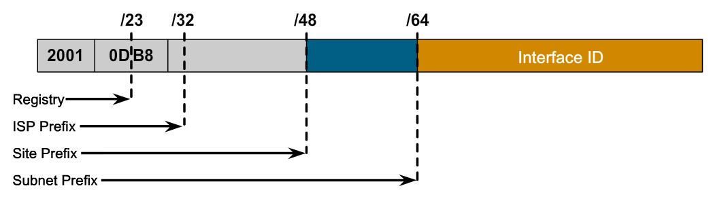

- [Control de servicios y demonios](#control-de-servicios-y-demonios)
  - [Servicios y demonios.](#servicios-y-demonios)
    - [Máscaras](#máscaras)
  - [El proceso de arranque](#el-proceso-de-arranque)
    - [Targets](#targets)
    - [Recuperación de la passwd de root](#recuperación-de-la-passwd-de-root)
    - [Consola de depuración](#consola-de-depuración)
    - [Stuck jobs](#stuck-jobs)
- [IPv6](#ipv6)
  - [Direcciones IPv6](#direcciones-ipv6)
    - [Subredes](#subredes)
  - [IPs comunes](#ips-comunes)
    - [Cálculo de direcciones locales (_link local_)](#cálculo-de-direcciones-locales-_link-local_)
  - [Configuración de direcciones IPv6](#configuración-de-direcciones-ipv6)
  - [Configuración](#configuración)
- [Agregación de enlaces (teaming) y bridging](#agregación-de-enlaces-teaming-y-bridging)
  - [Teaming](#teaming)
    - [Reglas: ¿Cómo maneja esto NetworkManager?](#reglas-cómo-maneja-esto-networkmanager)
    - [Trabajo con _team interface_](#trabajo-con-_team-interface_)
      - [Crear el interfaz](#crear-el-interfaz)
      - [Atributos IPv4/IPv6](#atributos-ipv4ipv6)
      - [Asignar puertos](#asignar-puertos)
      - [Cierre y arranque del Teaming](#cierre-y-arranque-del-teaming)
    - [Administración del Teaming](#administración-del-teaming)
    - [Troubleshooting](#troubleshooting)
  - [Software bridge](#software-bridge)
    - [Procedimiento para configurar un bridge por software](#procedimiento-para-configurar-un-bridge-por-software)
    - [Control de bridge](#control-de-bridge)
  - [Teaming + Bridging](#teaming--bridging)
- [Seguridad con los puertos de red](#seguridad-con-los-puertos-de-red)
  - [Cortafuegos: _firewalld_](#cortafuegos-_firewalld_)
    - [Notas](#notas)
    - [Reglas de firewall](#reglas-de-firewall)
      - [Reglas directas](#reglas-directas)
      - [Reglas enrriquecidas](#reglas-enrriquecidas)
      - [Ejemplos](#ejemplos)
      - [log y audit](#log-y-audit)
      - [Masquerades y port forwarding (NAT)](#masquerades-y-port-forwarding-nat)
  - [SELinux](#selinux)

# Control de servicios y demonios

## Servicios y demonios.

* **systemd** administra el arranque del sistema y los procesos y servicios del servidor (tiene el ID=1). En versiones anteriores, lo gestionaba **init** (tenía por debajo _xinetd_ y _initd_).
  - Puede paralelizar y aumentar velocidad del arranque.
  - Inicio bajo demanda de los servicios.
  - Administración automática de las dependencias de los servicios.
  - Podemos saber las dependencias del servicio -por arriba y por abajo.
  - Podemos hacer seguimiento de los servicios a través de los _linux control groups_, que se usan para agrupar servicios destinados al mismo fin.
* **daemon** proceso que ejecutan tareas que esperan y se ejecutan en segundo plano (convención, terminan su nombre por "d").
* Para comunicarse con los procesos usan **sockets**.

La _units_ son difentes tipos de "servicios", hay de diferentes tipos.

* Lista de tipos de unidades disponibles: `systemctl -t help`
  - _service_: servicios
  - _socket_: comunicaciones interprocesos, podemos usarlos para levantar servicios
  - _busname_
  - _target_
  - _snapshot_
  - _device_
  - _mount_
  - _automount_
  - _swap_
  - _timer_
  - _path:_ rutas del sistema que marcan un disparador (si dejamos algo, hará que algo se levante).
  - _slice_
  - _scope_
* Ver el fichero de configuración de una unit: `systemctl cat nombre`
* Ver todas las propiedades del la unit: `systemctl show nombre`
* Ver toda la información de una unit: `systemctl show nombre`
* Arrancar, parar, ...: `systemctl {start|stop|restart|reload} nombre`
* Ver estado: `systemctl status nombre` ("-l" más información)
  - Puede tener estos estados:
    - **loaded**: Se ha procesado el fichero de configuración
    - **active (running)**: Corriendo con uno o más procesos
    - **active (exited)**: Completada la configración OK
    - **active (waiting)**: Corriendo pero esperando un evento.
    - **inactive**: Parado
    - **enabled**: Arrancará en tiempo de boot
    - **disabled**: No arrancará en tiempo de boot
    - **static**: No puede ser habilitado, pero puede ser arrancado por otra unit de forma automática, no lo podemos tocar nosotros.
* Ver si está habilitado: `systemctl is-enabled servicio`
* Ver si está activo: `systemctl is-active servicio`
* Ver dependencias de nuestro servicio:
  - De quien depende nuestra unidad: `systemctl list-dependencies unidad`
  - Quien necesita mi unidad: `systemctl list-dependencies unidad --reverse`
* Listado de _unit files_
  - Verificar en el arranque: `systemctl`
  - Verificar el estado de los servicios: `systemctl --type=service`
  - Ver las units: `systemctl lsit-units [--all] --type=service` (muestra los activos, con "--all", todos).
  - Estado de las unidades en el arranque: `systemctl lsit-unit-files` (admite "--type")
  - Estado de las unidades que han fallado: `systemctl --failed --type=service`

### Máscaras

RH dice que no son compatibles **NetworkManager** y **network** y de hecho indican que el que manda el _NetworkManager_ y se apoya para ciertas cosas en _network_ y en caso de caída del primero, el segundo tomaría el control.

`systemctl {mask|umask} servicio`, lo que hace es un link a `/dev/null` de las unidades. (/etc/systemd/system/nombre.service` ó `/usr/lib/systemd/target`)

El enmascaramiento nos permite queSubredes nadie arranque de forma manual o automática el servicio.

## El proceso de arranque

### Targets

Estos son los targets del sistema:
* **graphical.target**: Sistema con múltiples usuarios, logins basados en texto y gráficos.
* **multi-user.target**: Sistema con múltiples usuarios y login basado en texto.
* **rescue.target**: _suloging_ prSubredesompt, inicialización básica del sistema
* **emergency.target**: _sulogin_ prompt y pivote _initramfs_ completo con / montado en modo sólo lectura.

Dependencias entre targets: `systemctl list-dependencies nombre.target|grep target`

Targets del sistema: `systemctl list-units --type=target --all`
  ```bash
  UNIT                   LOAD   ACTIVE   SUB    DESCRIPTION
  basic.target           loaded active   active Basic System
  cryptsetup.target      loaded active   active Encrypted Volumes
  emergency.target       loaded inactive dead   Emergency Mode
  final.target           loaded inactive dead   Final Step
  getty.target           loaded active   active Login Prompts
  graphical.target       loaded active   active Graphical Interface
  local-fs-pre.target    loaded active   active Local File Systems (Pre)
  local-fs.target        loaded active   active Local File Systems
  multi-user.target      loaded acSubredestive   active Multi-User System
  network-online.target  loaded inactive dead   Network is Online
  network.target         loaded active   active Network
  nfs.target             loaded active   active Network File System Server
  nss-lookup.target      loaded inactive dead   Host and Network Name Lookups
  nss-user-lookup.target loaded inactive dead   User and Group Name Lookups
  paths.target           loaded active   active Paths
  remote-fs-pre.target   loaded inactive dead   Remote File Systems (Pre)
  remote-fs.target       loaded active   active Remote File Systems
  rescue.target          loaded inactive dead   Rescue Mode
  shutdown.target        loaded inactive dead   Shutdown
  slices.target          loaded active   active Slices
  sockets.target         loaded active   active Sockets
  swap.target            loaded active   active Swap
  sysinit.target         loaded active   active System Initialization
  syslog.target          not-found inactive dead   syslog.target
  time-sync.target       loaded inactive dead   System Time Synchronized
  timers.target          loaded active   active Timers
  umount.target          loaded inactive dead   Unmount All Filesystems

  LOAD   = Reflects whether the unit definition was properly loaded.Subredes
  ACTIVE = The high-level unit activation state, i.e. generalization of SUB.
  SUB    = The low-level unit activation state, values depend on unit type.

  27 loaded units listed.
  To show all installed unit files use 'systemctl list-unit-files'.
  ```
* Cambiar a un target: `systemctl isolate nombre.target`
  - sólo los que tengan _AllowIsolate=yes_ pueden ser objeto de este cambio
* Obtener el target por defecto: `systemctl get-default`
* Cambiar el target por defecto: `systemctl set-default nombre`Subredes
  ```bash
  $ ls -l /usr/lib/systemd/system/default.target
  lrwxrwxrwx. 1 root root 16 Mar  8 16:24 /usr/lib/systemd/system/default.target -> graphical.target
  ```
* Podemos cambiar el target en el arranque cambiando la línea de kernel, poniendo: `systemd.unit=new_target.target` (normalmente ponemos _emergency.target_), después **Ctrl+X**
  - Recordar que una vez arreglado lo que se arregle, `systemctl daemon-reload` para que coja los nuevos fichreros de configuración que hayamos arreglado.

### Recuperación de la passwd de root
Subredes
Ya visto en el curso de SA:
1. Reiniciar el sistema
2. Interrumpir el _boot loader_ presionando una tecla
3. Pulsar "e" para entrar en la edición del arranque.
4. Editar la línea del kernel (_linux16_) y poner `console=tty0 rd.break`
5. Ctrl+x para arrancar con los cambios (aquí tenemos montado /sysroot con ro).
6. Montar en modo lectura/escritura: `mount -o remount,rw /sysroot`
7. Montamos la jaula chroot: `chroot /sysroot`
8. Cambiamos la password de root: `passwd root`
9. Indicamos que se restauren los contextos selinux en el siguiente arranque: `touch /.autorelabel`
10. Salimos dos veces (`exit; exit;`), la primera nos saca de la jaula y la segunda del _initramfs_

### Consola de depuración

`systemctl enable debug-shell.service`, nos hablitará la consola de depuración que no necesita meter la contraseña de root (nos metemos en ella con **Ctrl+Alt+F9**).
`systemctl start debug-shell.service`

### Stuck jobs

`systemctl list-jobs`, los servicios que estén en espera no arrancarán hasta que no arranquen los servicios de los que dependen. Así que si en el arranque tenemos algún problema tendremos que ver de que dependen los que están en waiting y ver por qué los otros no ceden el control.

# IPv6

Protocolo que sustituye a IPv4, llevSubredesa muchas más cosas por defecto.
* Direcciones más largas. (128 bits en vez de 32)
* IPSec activado por defecto.
* Muy autoconfigurable, basta con tener un router en la red que soporte IPv6.

El mayor problema que tiene es que el protocolo no tiene una forma simple para que sistemas que sólo tinen IPv6 se comuniquen con IPv4. Para solucionarSubredes esto se implementa _DualStrack_, que es configurar una red con IPv4 e IPv6 de forma que recursos de internet que usen uno de los protocolos puedean ser alcanzados desde el host.

## Direcciones IPv6

128 bits distribuidos en 8 grupos de 4 cuartetos hexadecimales, separados por "**:**". Cada cuarteto representa 4 bits de la dirección IPSubredesv6, con lo que cada grupo representa 16 bits.

Reglas de formación:
* Los ceros a la izquierda no se representan.
* Si en un grupo hay varios ceros, se agrupan (apócope): `2001:db8:0:10::1`
* No se pueden apocopar dos grupos de ceros: es incorrecto: `2001:b1::3b4::3a` por que no tenemos forma de saber cuántos grupos van en cada apócope.
* Para agrupar ceros, se apocopa el mayor conjunto o, en caso de igualdad, el de más a la izquierda: `2001::1f3a:0:0:3ab`Subredes
* Para representar IP:puerto, se pone la ip entre corchetes: `[2001:1bc::13f:0:a]:8080`

Las direcciones se clasifican en tres tipos:
* **Unicast**: Identificador para una única interfaz. Un paquete enviado a una dirección unicast es entregado sólo a la interfaz identificada con dicha dirección. Es el equivalente a las direcciones IPv4 actuales.
* **Anycast**:  Identificador para un conjunto de interfaces (típicamente pertenecen a diferentes nodos). Un  paquete enviado a una dirección anycast es entregado en una (cualquiera) de las interfaces identificadas con dicha dirección (la más próxima, de acuerdo a las medidas de distancia del protocolo de encaminado).  
	Nos permite crear, por ejemplo, ámbitos de redundancia, de forma que varias máquinas puedan ocuparse del mismo tráfico según una secuencia determinada (por el routing), si la primera “cae”.
* **Multicast**: Identificador para un conjunto de interfaces (por lo general pertenecientes a diferentes nodos). Un paquete enviado a una dirección multicast es entregado a todas las interfaces identificadas por dicha dirección.  
	La misión de este tipo de paquetes es evidente: aplicaciones de retransmisión múltiple (broadcast). 


### Subredes

Una dirección unicast normal e divide en dos partes, _prefijo de red_ e _interfaz ID_, el primero identifica la subred y el segundo la interfaz de red. Ningún par de interfaces de red pueden tener el mismo _interfaz ID_ en la misma subred.

* IPv6 tiene una máscara de subred estándar **/64**, la mitad de la dirección es subred y la otra mitad interfaz.
* Típicamente, el proveedor de red asigna un prefijo más corto a una organización, **/48**, lo que deja lo que deja el resto de la red para asignar subredes (16 bits --> 65536 subredes).



## IPs comunes

* **::1/128**: localhost
* **::**: Dirección sin especificar, indica que está escuchando por todas las IPs configuradas
* **::/0**: ruta por defecto
* **2000::/3**: Scope global (IPs públicas) - direcciones globales de unicast
* **fd00::/8**: Direcciones locales únicas (IPs privadas)
* **fe80::/10**: Scope link (link local)
* **ff00::/8**: multicast
* **ff02::1**: Dirección de multidifusión

### Cálculo de direcciones locales (_link local_)

Las direcciones de link local son direcciones no enrrutables que se usan sólo para hablar con los host en un enlace de red específico. Cada interfaz de red se configura automáticamente con un link-local en la red _fe80::/64_. Para asegurase de que es única, la _interfaz ID_ de la dirección se construye a partir de la MAC de esa interfaz.

1. Partimos de la MAC: `52:74:f2:b1:a8:7f`
2. Añadimos en el centro _ff:fe_: `52:74:f2:ff:fe:b1:a8:7f`
3. Pasmos el primer grupo a binario: `52 --> 01010010`
4. Invertimos bit 6: `01010000 --> 50`
5. Lo trasladamos a lo que teníamos: `5074:f2ff:feb1:a87f`
6. Añadimos la máscara del tipo de red: `fe80::5074:f2ff:feb1:a87f`

## Configuración de direcciones IPv6

Hay tres formas de configurar las direcciones:
* **Estáticas**: como en IPv4
	- No podemos usar las siguientes direcciones:
		- El interfaz ID todo ceros: _0:0:0:0_ llamado _subner router unicast_, que usan todos los routers del enlace.
		- Los identificadores entre: _fdff:ffff:ffff:ff80_ y _fdff:ffff:ffff:ffff_
* **Dinámicas**: dos formas distintas:
	- DHCPv6: Funciona un poco diferente que DHCPv4 ya que no hay broadcast:
		- Un host manda una petición DHCPv6 al puerto 547/UDP por **ff02::1:2** (grupo de multicast _all-dhcp-servers_)
		- El servidor DHCPv6 manda una respuesta con la información necesaria a través del puerto 546/UDP sobre la dirección local del cliente.
  - SLAAC (_Stateless Address Autoconfiguration_): Es el método por defecto en RHEL7, paquete **radvd**
		- El host levanta su interfaz con el link local: **fe80::/64**
		- Manda una solicitud de router a **ff02::2** (grupo de multicast _all-routers_).
		- Un router en el link local responde al link-local del host con un prefijo de red y otra información.
		- El host usa el prefijo con un _interfaz ID_ para construir la dirección de misma forma que lo hacer para la dirección del link-local.
		- El router manda periódicamente actualizaciones multicast (_router advertisements_) para confirmar o actualizar la información que provee.

## Configuración

Como en IPv4, también se usa **nmcli** cambiando v4 por v6


# Agregación de enlaces (teaming) y bridging

man 5 nmcli-examples
- 7 y 8 nos dan ejemplos de lo que tenemos que hacer bridge y teaming.

Más documentación:
* /user/share/doc/teamd-*
* /user/share/doc/bridge-utils/HOW-TO

## Teaming

El _Network teaming_ es una técina que nos permite enlazar lógicamente dos o mas tarjetas de red (NICs) como si fueran una sola de forma que nos dará ciertas ventajas.
* Tolerancia a fallos.
* Alta disponibilidad
* Mejora del rendimiento

Conceptos:
* **teamd** Nos permite manipular la lógica.
* El **kernel** manipula los paquetes del teaming.
* **runners** Los modos en que puede estar trabajando el teaming.
  - _broadcast_: A todos los nodos del teaming.
  - _round robin_: Distribución det trabajo entre los puertos.
  - _active backup_: Un puerto trabaja y el otro está de refuerzo.
  - _load balance_: distribuye la carga entre los interfaces que forman los puertos del teaming.
  - _LACP_: Preparado para ejecutar el protocolo de agregación 802.3ad - Pone los dos puertos trabajando a la vez, con lo que doblamos el ancho de banda.
* **port**: cada una de las NIC que forman el team

### Reglas: ¿Cómo maneja esto NetworkManager?

* El inicio del teaming no produce el reinicio automático de los puertos asignados.
* El inicio de un port produce un inicio automático del teaming
* La parada del teaming detiene las interfaces port
* Teaming sin ports (NIC) puede tener definida una ip estática.
* Teaming sin ports (NIC) configurado por DHCP espera a los puertos que lo componen (si no tenemos ningún puerto no tenemos red y no podrá recibir nada de DHCP).
* Teaming configurado por DHCP espera a los puertos hasta que uno de ellos tiene portadora.
* Teaming configurado por DHCP espera portadora (_waiting_).

### Trabajo con _team interface_

Lo vamos a hacer con _NetworkManager_ y con _network_.
1. Crear el teaming (interfaz).
2. IPv4/IPv6 teaming (configuración estática del interfaz).
3. Asignamos los ports.
4. Cierre y arranque del teaming (arranque de uno de los puertos al menos).

#### Crear el interfaz

```
nmcli con add type team con-name CNAME ifname INAME [config JSON]
```

Donde:
* CNAME: nombre del Teaming
* INAME: nombre de la interfaz del Teaming
* JSON: configuración en formato json que define el _runner_ de la forma: `'{"runner": {"name": "METHOD"}}'`
  - Donde _METHOD_ puede ser: _broadcast_, _roundrobin_, _activebackup_, _loadbalance_ o _lacp_
  - aunque este parámetro es optitivo, se pone siempre

#### Atributos IPv4/IPv6

Venimos de DHCP y asignamos ip estática:

```
nmcli con mod CNAME ipv4.addresses IP/PREFIX GW
nmcli con mod CNAME ipv4.method manual
```

#### Asignar puertos

Mirar las lineas que vienen en `man nmcli-examples` (ojo, dependiendo de las verisones, puede cambiar el ejemplo).

```
$ nmcli con add type team-slave con-name Team1-slave1 ifname em1 master Team1
$ nmcli con add type team-slave con-name Team1-slave2 ifname em2 master Team1
```

Si no se le pone nombre de la conexión, por defecto nos da _bond-slave-IFACE_

#### Cierre y arranque del Teaming

Desconectamos un dispositivo y 
```
nmcli dev dis <interfaz_slave>
nmcli dev con up <conex_slave>
```

### Administración del Teaming

Todos los ficheros de configuración están en `/etc/sysconfig/network-scripts/` como en cualquier tipo de interfaz de red.

Variables importantes de los ficheros de configuración:
* **DEVICETYPE**: Puede ser _team_ o _port_.
* **TEAM_CONFIG**: aquí viene el json de configuración

### Troubleshooting

* `teamdctl <team_name> ports`: Muestra los puertos del team
* `teamdctl <team_name> getoption activeport`: Muestra el puerto activo
* `teamdctl <team_name> setoption activeport`: Cambia el puerto activo
* `teamdctl <nombre> status`: Muestra el estado del Team
* `teamdctl <team_name> config dump`: saca un json con la configuración, si lo pasamos a fichero, podemos luego manipularlo para cargar configuraciones de teaming.
* `nmcli con mod <team_name> team.config <fichero>`

## Software bridge

El bridge está basado en direcciones MAC. Está para dar servicio a NICs virtuales.

En virtualizadores, tendremos unas cuantas tarjetas vituales, si cambiamos la configuración de la máquina virtual, nos cambia la MAC, se interpreta que es otra tarjeta y se pierden las configuraciones.

NICs virtuales, tienen una tabla de MACs

### Procedimiento para configurar un bridge por software

`man nmcli-examples`, ejemplo 8.

```
$ nmcli con add type bridge con-name TowerBridge ifname TowerBridge
$ nmcli con add type bridge-slave con-name br-slave-1 ifname ens3 master TowerBridge
$ nmcli con add type bridge-slave con-name br-slave-2 ifname ens4 master TowerBridge
$ nmcli con modify TowerBridge bridge.stp no
```

El bridge no admite interfaces agregadas con NetworkManager, lo que implica que si queremos agregar interfaces habrá que tocarlo a mano en los ficheros de configuración.

Esto será util si queremos añadir un Teaming a un Bridge. (Tenemos unas cuantas máquinas virtuales con sus mac virtuales y queremos que salgan de la máquina física).

En el fichero de configuración hay un campo interesante: `STP=yes`, que indica que se active el protocolo `Spanning Tree` para evitar que haya bucles.

### Control de bridge

`brctl show`: Nos muestra los bridges software.

## Teaming + Bridging

1. NetworkManager (lo tenemos activo).
     * Generación standar del teaming (no vamos a tocar las IPs) (Team + Ports)
2. Desactivamos Team0 y NetworkManager (ya no funciona nmcli).
    * `nmcli dev dis team0`
    * `systemctl stop NetworkManager && systemctl disable NetworkManager` (o mask)
3. Creamos el bridge: **br0team**
     * creamos el fichero: `ifcfg-br0team` con el siguiente contenido:
        - DEVICE
        - BOOTPROTO: 
        - ONBOOT: none
        - IPPADDR
        - PREFIX
4. Editar `ifcfg-team0` y poner `BRIDGE=br0team`
5. Configuraciones de ip dentro de los puertos que aparezcan en _ip config_ se eliminan
6. Reinicio de `systemctl restart network.service`

# Seguridad con los puertos de red

## Cortafuegos: _firewalld_

**firewalld.service** es el método por defecto en RHEL7 para manejar los firewall de alto nivel. Se basa en el subsistema _netfilter_ del kernel de Linux. Entra en conflicto con **iptables**, **ip6tables** y **ebtables** por lo que lo mejor es enmascarar estos:

```bash
for SERVICE in iptables ip6tables ebtables
do
  systemctlt mask ${SERVICE}.service
done
``` 

Recordar siempre que vamos a limitar el acceso a nuestra máquina. (Nosotros somos la máquina que es susceptible de ser atacada y a la que hay que protejer).

**firewalld** divide el tráfico en zonas usando los siguientes criterios:
* ip fuente
* interfaz entrante
* zona default (por defecto: public).

Podemos administrar el firewall con:
* firewall-cmd (se instala con el paquete de firewalld, no se instala en un mínima pero si en la base).
* firewall-config
* Manipular `/etc/firewalld` (esto no lo recomienda RedHat).

Los cambios que hagamos se hacen en runtime a no ser que pasemos el parámetro `--permanent`, y en este caso, para pasar a runtime tendremos que hacer `--reload`, y viceversa con `--runtime-to-permanent`.

Podemos establecer un timeout `--timeout=<secs>`, en runtime, ponemos una regla en runtime y está activa hasta que pasa el timeout.

El sistema también tiene `/usr/lib/firewalld` que son los defectos del sistema (así que ojito con tocarlo).

### Notas

* Versiones post-RHEL 7 de firewalld incluyen una vía simple para hacer los cambios de runtime permanentes:
  ```bash
  firewall-cmd --runtime-to-permanent
  ```
* Añadir interfaz a una zona
  ```bash
  > firewall-cmd --permanent --zone=internal --change-interface=eth0
  success
  > nmcli con show | grep eth0
  System eth0  4de55c95-2368-429b-be65-8f7b1a357e3f  802-3-ethernet  eth0
  > nmcli con mod "System eth0" connection.zone internal
  > nmcli con up "System eth0"
  Connection successfully activated (D-Bus active path: /org/freedesktop/NetworkManager/ActiveConnection/1)
  > firewall-cmd --get-zone-of-interface=eth0 
  internal
  ```
    Esta operación tambión se puede hacer editando `/etc/sysconfig/network-scripts/ifcfg-eth0` y añadiendo `ZONE=internal` seguido por `nmcli con reload`
* Crear nuevas zonas
  ```bash
  > firewall-cmd --permanent --new-zone=test
  success
  > firewall-cmd --reload
  success
  ```
* Mostrar las fuentes admitidas en una zona
  ```bash
  > firewall-cmd --permanent --zone=trusted --list-sources
  192.168.2.0/24 00:11:22:33:44:55 ipset:iplist
  ```
* Sacar información de zonas (desde RHEL 7.3):
  ```bash
  > firewall-cmd --info-zone=public
  public (active)
  target: default
  icmp-block-inversion: no
  interfaces: eth0
  sources:
  services: dhcpv6-client ssh
  ports:
  protocols:
  masquerade: no
  forward-ports:
  sourceports:
  icmp-blocks:
  rich rules:
  ```
* Añadir servicios a una zona
  ```bash
  > firewall-cmd --zone=internal --add-service={http,https,dns}
  success
  ```
* Sacar ifnormación de servicios (desde RHEL 7.3)
  ```bash
  > firewall-cmd --info-service=ftp
  ftp
    ports: 21/tcp
    protocols: 
    source-ports:
    modules: nf_conntrack_ftp
    destination:
  ```
* Desde RHEL 7.3 se pueden crear _ipsets_. Un _ipset_ es un conjunto de direcciones IP o redes.  
  Las diferentes categorías pertenecen a `hash:ip` o `hash:net`.
  - Para crear un ipset IPv4 permanente que contenga 2 direcciones IP y que rechace dos paquetes que vengan de esas direcciones: 
  ```bash
  > firewall-cmd --permanent --new-ipset=blacklist --type=hash:ip
  success
  > firewall-cmd --reload
  success
  > firewall-cmd --ipset=blacklist --add-entry=192.168.1.11
  success
  > firewall-cmd --ipset=blacklist --add-entry=192.168.1.12
  success
  > firewall-cmd --add-rich-rule='rule source ipset=blacklist drop'
  success
  > firewall-cmd --info-ipset=blacklist
  blacklist
  type: hash:ip
  options:
  entries: 192.168.1.11 192.168.1.12
  ```
  - Para crear un ipset IPv4 que contenga 2 redes:
  ```bash
  > firewall-cmd --permanent --new-ipset=netlist  <- falta type????
  success
  > firewall-cmd --reload
  success
  > firewall-cmd --ipset=netlist --add-entry=192.168.1.0/24
  success
  > firewall-cmd --ipset=netlist --add-entry=192.168.2.0/24
  success
  > firewall-cmd --info-ipset=netlist
  netlist
    type: hash:net
    options: 
    entries: 192.168.1.0/24 192.168.2.0/24
  ```
* Para borrar el netlist ipset: 
  ```bash
  > firewall-cmd --permanent --delete-ipset=netlist
  success
  > firewall-cmd --reload
  success
  > firewall-cmd --get-ipsets
  blacklist
  ```

Es posible cargar el contenido de un ipset desde fichero (`--add-entries-from-file=file option`) o guardarlo en `/etc/firewalld/ipsets/ipset.xml`

### Reglas de firewall

Aparte de las zonas para añadir reglas, los administradores tienen otras dos vías, "reglas directas" y "reglas enriquecidas" (_rich rules_).

#### Reglas directas

Ver `man firewall-cmd` y `man 5 firewalld.direct`, consiste en meter a mano reglas de iptables (ip6tables o ebtables) en las zonas administradas por _firewalld_. Estas reglas pueden llegar a ser difíciles de manejar y ofrecen menos flexibilidad que las reglas estándar y las _rich rules_.

A no ser que sean explicitamente insertadas en una zona controlada por _firewalld_, las reglas directas se evalúan antes que cualquier otra regla de _firewalld_.

#### Reglas enrriquecidas

Proveen a los administradores un lenguaje en el que expresar reglas de firewall que no son cubiertas por la sintaxis básica de _firewalld_. Nos permitirán conexiones a un servicio desde una sóla IP, configurar logs, guardar los logs, reenvío de puertos y conexiones. Más información en `man 5 firewalld.richlanguage`

Formato:

```text
rule
  [source]
  [destination]
  service|port|protocol|icmp-block|masquerade|forward-port
  [log]
  [audit]
  [accept|reject|drop]
```

Estos valores, toman la forma: `option=value`. La diferencia entre _reject_ y _drop_, es que el primero devuelve respuesta y el segundo tira el paquete. 

Para aplicar las reglas usa un orden:
1. Enmascaramientos / Port forwarding
2. logs (secciones log y audit)
3. denys
4. accept

**OJO** todo lo que no esté explicitamente permitido, está denegado.

Podemos utilizar el flag `--timeout` o el `--permanent`.

* **Añadir una regla**: `--add-rich-rule='<regla>'`
* **Borrar uan regla**: `--remove-rich-rule='<regla>'`
* **Ver una regla**: `--query-rich-rule='<regla>'`
* **Ver todas las reglas**: `--list-rich-rules`

Hay que definir una familia `family=ipv4` cuando se defina _source_ o _destination_.

De cara al exámen, cada vez que configuremos un servico, tendremos que abrirlo en el firewall (y ponerle las reglas que nos indiquen).

#### Ejemplos

Rechazar 192.168.1.11 en la zona classroom
  ```
  firewall-cmd --permanent --zone=classroom --add-rich-rule='rule family=ipv4 source address=192.168.0.11/32 reject'
  ```
Limitar en tiempo de ejecución el servicio ftp con un límite de 2 conexiones por minuto aceptadas.
  ```
  firewall-cmd --add-rich-rule='rule service name=ftp limit value=2/min accept'
  ```
Descartar todos los paquetes del protocolo esp (ipsec).
  ```
  firewall-cmd --permanent --add-rich-rule='rule protocol value=esp drop'
  ```
Aceptar todos los paquetes TCP, puertos 7900 a 7905, zona vnc, para la subred 192.168.1.0/24
  ```
  firewall-cmd --permanent --zone=vnc --add-rich-rule='rule familily=ipv4 source address=192.168.1.0/24 port port=7900-7905 protocol=tcp accept'`
  ```

#### log y audit

Podemos limitar el número de entradas que podemos meter en los logs (de otra forma, tendríamos ficheros de log kilométricos), ojo que las reglas de log se evalúan primero. Suelen ser las reglas parecidas a la que hemos hecho del número de conexiones.  
**OJO**: Las reglas de log se procesan al primero peeero, primero se procesan las "deny", y luego las "accept", ya que el control de acceso de los logs pasa a los siguientes.

Entrada típica de log: `log [ previx="texto" [level=<serverity_de_rsyslog>] [limit value="<rate/duracion>"]]` donde duración puede ser:
 - 1/s -> mensaje por segundo y conexión
 - 1/m -> mensaje por minuto y conexión
 - 1/h -> mensaje por dia y conexión
 - 1/d -> mensaje por día y conexión

Entrada típica de audit: `audit [limit value="<rate/duracion>"]`

Guardar logs de ssh (3 por minuto), configuración permanente:
  ```
  firewall-cmd --permanent --zone=work --add-rich-rule='rule service name="ssh" log prefix="ssh_firewall " level="notice" limit value="3/min" accept'
  ```
  - esto puede ser interesante de cara a controlar que realmente el servicio está funcionando.
  - nos puede permitir protegernos contra ataques de denegación de servicio sencillas (por lo menos, las que se basan en llenar el disco).

#### Masquerades y port forwarding (NAT)

NAT (_Netork Address Translation_). Dos posibles problemas a resolver... por un lado, tenemos lo que está dentro de nuestra red (detrás de un router) que tiene salida a internet a través de ese ruta, y es el GW de nuestra red interna.

**Masquerading**: Nos permite reenviar paquetes a una ip externa a través de nuestro router, y que nuestro router nos lo devuelva. De nuestro router para fuera, se verá la IP pública de nuestro "enmascarador". Sólo se puede usar con IPv4.

1. Tenemos la VM1 (10.0.0.100, gw: 10.0.0.1) que quiere ir a la 2.17.39.214. 
2. Como no está en la red tiene que salir por gw por defecto (que es la dirección del FW -y del GW). 
3. El router (10.0.0.1) enmascara, cambia el paquete la dirección de origen y pone la suya (1.2.3.4), escribe en una tabla de conexiónes de quién viene la conexión (interna).
4. Vuelve el paquete al FW y busca en su tabla de conexiónes para ver a quien se lo tiene que devolver
5. el FW envía el paquete al 10.0.0.10

**Sintaxis**: 
* Regla básica: `firewall-cmd --permanent --zone=<zone> --add-masquerade` 
* Rich Rule: `firewall-cmd --permanent --zone=<zone> --add-rich-rule='rule family=ipv4 source address=192.168.0.0/24 masqeuerade'`

**Port forwarding**: Voy a habilitar una serie de puertos en el FW que se corresponderán con servicios internos. El problema es... ¿cómo vuelve el tráfico?, si queremos salir vamos a necesitar además, un enmascaramiento. Se usa para ocular un servidor tras otra máquinas... de cara al exterior es la máquina de fuera la que responde, pero internamente apunta al servidor interior o para proporcionar servicio en otro puerto.
* Básico:
```
firewall-cmd --permanent --zone=<zone> --add-forward-port=<port_number>:proto=<protocol>[:to-port=<port_number>][:to-addr=<ip_addr>]
```
_toport_ o _toaddr_ son opcionales, ¡¡¡Pero no los dos a la vez!!!
* Rich-rule:
```
firewall-cmd --permanent --zone=<zone> --add-rich-rule='rule family=ipv4 forward-port port=<port_number> protocol=tcp|udp [to-port=<port_number>][to-addr=<ip_addr>]'
```

## SELinux

Vamos a ir etiquetando los puertos. La política que estamos usando sigue siendo la _targeted_. 
* Puerto 22/tcp: Etiqueta `ssh_port_t` --> de esta forma un servicio sin derechos a usar estos puertos, no podrá usarlo.
* Si queremos usar un puerto no estándar, tendremos que configurarlo en SELinux y hacer un módulo de SELinux que implemente la política.

* `semanage port -l`: listado de puertos  
  Formato: `tipo_contexto_puerto tpc|udp puertos,separados,por,comas` (una línea para TCP y otra para UDP en su caso).
* `semanage port -l -C`: lista puertos añadidos a la política (recordemos, que para la misma política puede haber dos líneas).
* `system-config-selinux`: herramienta gráfica para manipular SELinux (se instala con _policycoreutils-gui_)
* Configuracón de puertos: 
  - Crear una nueva política: `semanage port -a -t port_label_t {tcp|udp} port_number`
  - Modificar una política: `semanage port -m ...`
  - Borrar una política: `semanage port -d ...`

El paquete _selinux-policy-devel_ nos instala las ayudas de SELinux, una vez instalado, regeneramos la BD de ayuda (`mandb`) y una vez hecho esto podemos buscar con `man -k _selinux`

# DNS

DNS = _Domain Name Service_ Es el servicio que provee la resolución de nombres, e.d. a cada IP le asigna un nombre.

Es un sistema jerárquico basado en ficheros y sistemas en red. La información en el directorio mapea nombres de red a datos que son mantenidos en entradas lógicas llamadas _registros de recursos_.

## Definiciones

* **Dominio (_domain_)**: Es una colección de registros que terminan en un nombre común y representa un árbol entero del espacio de nombres DNS. El mayor dominio posible es el _root domain_, "**.**".
* **Subdominio (_subdomain_)**:
* **Zona (_zone_)**:
* **Registros de recursos**: Definen pares IP-Nombre.
* La **jerarquía** empieza por "**.**", de donde parten las ramas de los diferentes dominios (net., com., co.uk., es.)
* **Dominio DNS** recopilación de registros DNS que parten de un nombre común.
* **Generic TLDs** Dominios de nivel superior genéricos (.com, .net, ...)
* **Country Codes TLDs** Dominios de nivel superior de nombres de país.
* **Subdominio** Subárbol de  un dominio superior.
* **Zona** Parte de un dominio de la que el servidor es la autoridad

## Búsquedas DNS

Nuestra máquina en `/etc/resolv.conf` hace una búsqueda en los servidores de dominio que tiene configurados (como cliente) y de ahí consulta a los servidores DNS.

**_¿Cómo hago la búsqueda?_**
1. **Datos autoritativos locales**: Yo soy responsable de una zona de DNS, cuando me llega la consulta de DNS respondo diciendo que es una _authoritative answer_ (**aa**). Una vez resuelta la consulta la cacheo con un tiempo de vida (TTL) para futuras consultas.  
  Ataque típico: _Autoritative Poissoning_, alguien se hace pasar por un DNS válido y mete en caché datos falsos para que vayamos a otros lugares falsos en vez de a los auténticos.
2. **Datos no autoritativos locales en caché**: se queda con la respuesta del autoritativo que le ha respondido y la próxima búsqueda que necesite, tira de él porque la ha almacenado en la caché DNS. Sigo respondiendo con un dato en local que tiene un una caché.
3. **Datos no autoritativos remotos obtenidos recursivamente**: los obtengo de los **aa** superiores.

Formato registro: `owner-name  TTL class  type	 data`

### Tipos de registros

* **A**: Tipo Registro Host IPv4. (`example.com. TTL IN	A 172.25.254.254`)
* **AAAA**: Tipo Registro Host IPv6. (`example.com. 86400 IN AAAA <ipv6>`)
* **CNAME** (Alias DNS): Un nombre que apunta a otro nombre (`www.example.com TTL IN  CNAME	www.redhat.com`), hay que tener cuidado, porque podemos hacer bucles.
* **PTR** (pointer): Asigna direcciones IP a nombre de host (Resolucion DNS inversa) 
  - IPv4: `in.addr.arpa.`, se le da la vuelta a la IP (`10.10.25.172.in.addr.arpa. TTL IN PTR desktop0.example.com`)
  - IPv6: `ip6.arpa.`, lo mismo que en la anterior, (le damos la vuelta a la dir IPv6)
* **NS** (name server): Mapea un nombre de dominio indicando quién es la autoridad para su zona. Este es obligatorio para ser una zona DNS.
* **SOA** (Start of Authority): Contiene informacion sobre la zona de DNS.
  - servidor primario/maestro de la zona. (_Master namesever_)
  - Información sobre el modo de trabajo de los esclavos
  - contacto con admin. de la zona (_RNAME_)
* **MX** (mail exchange): Mapea un nombre del dominio como servidor de correo que aceptará correos para ese nombre.
  - Viene un número de preferencia
  - Un nombre de host
* **TXT** (text): Contienen datos.
* **SRV** (service): Se usan para localizar los servidores del dominio que proporcionan cierto servicio.
  - `_service._protocol.domainname. TTL IN SRV p w 17.30.212.11`
  - Identifica servicios
  - Campo peso se puede usar añadido al de prioridad, a igual prioridad, el de más peso lleva más el servicio.

### Host típico

* **Cliente o server sencillo**:
  - 1 ó mas A ó AAAA
  - 1 ó mas PTR
  - 1 ó mas CNAME
* **Zona DNS**:
  - 1 SOA
  - 1 ó mas NS
  - 1 ó más MX
  - Opcionales:
    - TXT
    - SRV

## Cacheo de NameServer

**NOTA**: Esto cae en el exámen de ingeniero sí o sí. Cómo montamos un DNS.

Vamos a configurar un DNS que use DNSSec para confirmar que la entidad autoritativa es quien dice ser, y después de esto, guardarlo en caché. Esto es muy importante sobre todo al principio cuando no tenemos todavía entradas en nuestra resolución de nombres.

DNS trabaja con el 53/UDP, pero para ciertos tamaños de la consulta usa 53/53/53/53/53/TCP.

Paquetes **unbound** (servidor DNS con DNSSec habilitado por defecto), **bind**, **dnsmasq**:
1. Instalar unbound `yum install -y unbound`
2. Habilitamos en el inicio y arrancamos: `systemctl start unbound.service && systemctl enable unbound.service`
3. Tocar ficheros de configuración: `/etc/unbound/unbound.conf`
  * `interface: 0.0.0.0` por defecto: escucha en todas las interfaces, en localhost
  * `interface: <ip_servidor>`, esto para un servidor
  *  Por defecto rechaza todo, a no ser que metamos esta directiva, define la subred: `access-control: 172.25.0.0/24 allow`:
  * todo lo que no atendamos nosotros los resolverá la _forward-zone_:
    ```
    forward-zone:
      name: "."
      forward-addr: 172.25.254.254
    ```
  * Validación DNSSec, tenemos que poner lo que excluimos de la validación con _domain-insecure_:
    ```
    domain_insecure: example.com
    ```
  * Instalar entidades de autorización (_trust-anchor_), para lo que tendremos que obtener el registro DNSKey para la clave de firma KSK (clave de la zona):
    - Obtenemos la clave
    ```
    dig +dnssec DNSKey example.com
    ```
    - añadimos la línea: `trust-anchor: "example.com <ttl> IN DNSKEY x y z <clave obtenida en el paso anterior>"`
4. Guardamos el fichero de configuración.
5. Chequeamos la sintaxis: `unbound-checkconf`
6. Reiniciamos: `systemctl restart unbound`
7. Añadimos al firewall:
  ```
  firewall-cmd --permanent --add-service=dns
  firewall-cmd --reload
  ```

Con esto tenemos funcionando el DNS.

### Trabajar con la caché

* Volcado de la caché: `unbound-control dump_cache > dump.out`
* Carga de la caché: `unbound-control load_cache dump.out`
* Purgado de un registro (aunque no haya superado el TTL): `unbound-control flush www.example.com`
* Purgado de una zona: `unbound-control flush_zone example.com`
* `dnssec-trigger`: reconfigura el fichero de unbound para que podamos obtener el caché de los servidores confiables.
  - hay que instalar el paquete `yum install -y dnssec-trigger`

## Trobleshooting

Hacer consultas al DNS, herramientas
* `host -v -t A example.com` 
* _Domain Internet Groper_: `dig @servidor <tipo> <nombre_búsqueda>`
* **getent** del paquete _glibc-common_
* **gethostip** del paquete _syslinux_

Puntos de fallo:
* Dado que DNS se basa en una estructura jerárquica, hay muchos posibles puntos de fallo que investigar cuando falla algo.
* El uso de caché va a reducir la carga del DNS y mejora su rendimiento, pero añade otro punto de fallo si no está actualizada la caché.

El punto crítico en el trobleshooting del DNS es pillar enseguida el punto de fallo.

### Posibles fallos

1. El caché del servidor está desactualizado. 
2. El fichero `/etc/hosts` ó `/etc/nsswitch.conf` no están bien:
  - `getent hosts <dominio>`
  - `gethostip <dominio>`
3. Cliente: Fichero `resolv.conf` en la parte cliente. ¿bien configurados los DNSs?
4. Cliente: ¿Problemas de network? ¿están abiertos los puertos 53/udp, 53/tcp?
  - Inicialmente las comunicaciones son por udp, pero si la trama supera 512 bytes en servidores estándar ó 4096 bytes en servidores EDNS, las gestiona tcp.
  - Nos puede dar una pista que unas veces funcione y otras no.
  - Para comprobar que está habilitado: `dig +tcp A example.com`
5. Usar _dig_ para preguntar a DNS.
6. Servidor: Si hay IPs incorrectas, ver la parte de _forward-zone_ de la configuración.
7. Comprobar el firewall 

También podemos usar **tcpdump** para ver el tráfico de networking... luego se puede procesar el fichero de salida con _whireshark_.

### dig

Suele soltar información relacionada con la consulta que hemos hecho:
```
> dig @server12 A example.com
; <<>> DiG 9.9.4-RedHat-9.9.4-14.el7 <<>> @server12 A example.com
; (1 server found)
;; global options: +cmd
;; Got answer:
;; ->>HEADER<<- opcode: QUERY, status: NOERROR, id: 33692
;; flags: qr rd ra; QUERY: 1, ANSWER: 1, AUTHORITY: 0, ADDITIONAL: 1

;; OPT PSEUDOSECTION:
; EDNS: version: 0, flags:; udp: 4096
;; QUESTION SECTION:
;example.com.			IN	A

;; ANSWER SECTION:
example.com.		86400	IN	A	172.25.254.254

;; Query time: 0 msec
;; SERVER: 172.25.12.11#53(172.25.12.11)
;; WHEN: Tue Apr 09 20:31:35 CEST 2019
;; MSG SIZE  rcvd: 56
```

Nos puede devolver un código de error:
* **SERVFAIL**: El servidor tiene un fallo procesando la petición.
  - Debido a que el Servidor de Nombres Autoritativos no está disponible.
  - Problemas de cortafuego
  - Problemas de red
  - Lo primero es saber a qué servidor no llegamos: `dig +trace example.com`
* **NXDOMAIN**: No encuentra los registros
  - Alias apuntando a algo que ya no existe
  - Se ha borrado de la caché
* **REFUSED**: El servidor rechaza la petición del cliente
  - El cliente no pertenece al segmento de red autorizado

### Fallos de caché.

* `dig A example.com`: comprobar que nos responde con el flag **aa**, esto nos da la seguridad de que no nos responde de caché.
* Comprobar el TTL (si va disminuyendo es que estamos consultado a caché).
* Registro borrado que sigue respondiendo: alguien ha metido `*.example.com IN A <ip>`. Esto se resuelve definiendo los registros con FQDNs.
* Los NS, MX, SOA estén correctamente definidos
* Ojo a los bucles: CNAME que apunte a otro CNAME que apunta al primero.
* Un CNAME que se queda huérfano no devuelve error.
* PTRs, afectarán a las búsquedas inversas... y con el `netstat` nunca acaba (si no es numérico).
  - si tiras el netstat (sin -n) no responde núnca.

Una cierta protección de esto es el **_Round-robin DNS_**, que consiste a un mismo nombre darle diferentes IPs, de forma que se hace cierto balanceo de carga, cada vez responde con una IP distinta.

**OJO**, como alguna esté mal, se saque de mantenimiento o algo así, podemos dar fallos intermitentes.

# Configurar servidor de correo

Vamos a usar **postfix**. Postfix se apoya en _sendmail_ (`/usr/sbin/sendmail`) que se instala cuando se instala postfix.

¿Por qué postfix? Es el predeterminado de RHEL7 (paquete postfix).

Lo que vamos a hacer es un servidor nulo (_NULL CLIENT_) que mandará los correos que reciba a un servidor SMTP.

Usaremos **mutt** para ver los correos (probar).

## Definiciones.

* **MUA (_Mail User Agent_)**: El que envía
* **MTA (_Mail Transfer Agent_)**: Agente de transferencia de correo (recibe y envía).
* **MSA (_Mail Sender Agent_)**: Agente de envío de correo. Escucha por el puerto 587/tcp donde sí que estás autenticado.
* **Cliente null**: Crearemos un servidor de Postfix que nos escuchará a nosotros y reenviará los correos que le pasemos nosotros, tendrá configurado un servidro SMTP al que enviará los correos.
  - Reenvía todos los correos electrónicos a SMTP
  - No acepta correos locales (sólo rebota los correos que le lleguen).
* Puerto SMTP: 25/tcp (sin autenticación).
  - Es el propio SMTP tiene configurado a quien permite hacer relay.

El postfix, si no le indicamos lo contrario, buscará en el DNS un registro MX que se asemeje a lo que le estemos pasando.

* POP3: Los mensajes los descargas para siempre
* IMAP: conserva los mensajes en el servidor.

## Funcionameinto de SMTP

Incialmente enviamos a SMTP
Vamos al DNS para encontrar el servidor de correo


Postfix es modular:
* Proceso principal: master
* Ficheros de configuración:
  - `/etc/postfix/main.cf`: directivas
  - `/etc/postfix/master.cf`: Módulos que se levantan, para afinar el funcionamiento

## Directivas

Vienen en el `/etc/postfix/main.cf`. Ojo, que el fichero no se come cualquier cosa. El fichero no se editará, si no que se usará **postconf**.
* **inet_interfaces**:
* **myorigin**:
* **relayhost**:
* **mydestination**:
* **local_transport**:
* **mynetworks**:

### inet_interfaces

Controla por qué interfaces de red escucha Postfix para mensajes entrantes y salientes.
* **loopback-only** escucha en 127.0.0.1 y en ::1 (interfáz de loopback).
* **localhost** valor por defecto
* **all** escucha en todas las interfaces de red
* Uno o más interfáces puede incluirse en la lista.

### myorigin

Vuelve a escribir el correo electrónico enviado localmente para que parezca del dominio que pongamos en este campo.
* Defecto: $myhostname

Si envías desde el dominio de máquina, la respuesta irá al dominio de la máquina y no a la empresa.

### relayhost

A qué servidor tiene que reenviar los mensajes: servidor SMPT. Entre corchetes, busca en el regisro del DNS `[smtp.example.com]`

Por defecto viene vacío. Todos los email se interpretan como locales y se los queda.

### mydestination

Dominios de los correos que me quedo para entregar localmente. Configura los dominios para los que el servidor de correo es punto final. En el caso del _null client_ rebotamos todos.

Valor por defecto: `($myhostname, localhost@mydomain, localhost)`

### local_transport

Tiene definido qué medio va a usar para hacer las entregas locales. en el caso del _null client_.

Valor por defecto: `local:$myhostname`

Con el valor: `error: local error disabled`

### mynetworks

Indica las direcciones IP o lista de subredes CIDR (separadas por coma) a las que permitimos la transmisión de correos a través del servidor.

* Valor por defecto: `$mynetworks.style=subnet` --> permite el relay de todas las interfaces en las que tengamos una pata (ojo si tenemos entre ellas una IP pública).
* Valor predeterminado: `mynetworks = 127.0.0.1/8 [::1]/128`

## Configuración de un cliente NULL

Los cambios de configuración se toman cuando se hace un restart del servicio `
* `postconf <var1> <var2> ...` para consultar las variables
* **$** indica que es una variable
* Para ver todas las variables: `postconf`
* `postconf -e "setting = value"`: cambia el valor de la variable
  - EJ: `postconf -e "myorigin = example.com"
* `/var/log/maillog`: Se escriben los log de las interacciones.
* `postqueue`: consulta la cola de mensajes
  - **-p**: mostrar mensajes
  - **-f**: fuerza el reenvio de los mensajes en la cola (si no hacemos nada, en 1h vuelva a intentar enviarlos).

Para configurar el cliente nulo en RHEL7
1. sendmail --> relay smtp
2. postfix no acepta ninguna entrega local
3. Cliente de correo (nulo) para enviar y recibir los emails.


### Ejemplo de configuración.

1. Vamos a configurar server12.example.com
2. usará smpt12.example.com como servidro SMTP
3. La dirección del remitente tiene que ser: desktop12.example.com

Proceso.
1. `postconf -e "relayhost = [smtp12.example.com]"`
2. `postconf -e "inet_interfaces= loopback-only"`
3. `postconf -e "mynetworks=127.0.0.0/8 [::1]/128"`
4. `postconf -e "myorigin=desktop12.example.com"`
5. `postconf -e "mydestination="`: No me quedo con nada
6. `postconf -e "local_transport=error: local delivery disabled"`: No manda correos locales a nadie
7. `systemctl restart postfix`
